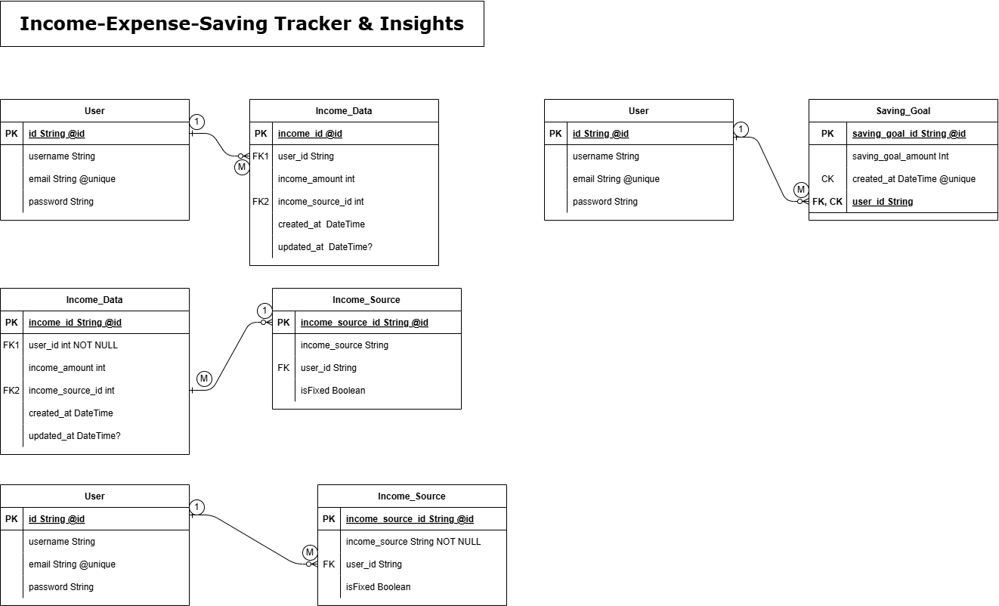

# Fynsights

A fullstack finance insights app that helps users track income, expenses, saving goals, and get written insights based on their financial data.

This repository contains the backend of the application.

Live demo: [Fynsights](https://fynsight.vercel.app/)

---

## What this backend does

- Handles API requests from the frontend
- Verifies Firebase ID tokens
- Manages database operations using Prisma
- Generates written financial insights using predefined logic
- Supports full CRUD operations
- Implements pagination, filtering, and sorting

All protected routes require authentication.

---

## Tech stack

- Node.js
- Express.js
- PostgreSQL
- Prisma ORM
- Firebase Admin SDK
- Zod for input validation
- CORS
- Cookie parser
- Nodemon
- Postman

Backend is hosted on Render.  
Database is hosted on Supabase.

---

## Database Model



---

## Authentication

- Firebase Admin SDK is used for ID token verification
- Every protected route validates the token
- Requests without valid tokens are rejected

---

## Environment variables

Create a `.env` file in the root of the backend project:

```env
PORT=3000

FIREBASE_API_KEY=""
FIREBASE_AUTH_DOMAIN=""
FIREBASE_PROJECT_ID=""
FIREBASE_STORAGE_BUCKET=""
FIREBASE_MESSAGING_SENDER_ID=""
FIREBASE_APP_ID=""

DATABASE_URL=""
```

---

## Running the backend locally

1. Clone the repository

```bash
git clone https://github.com/SHREERAJ10/finance-insights-backend.git
cd finance-insights-backend
```

2. Install dependencies

```bash
npm install
```

3. Setup Prisma

```bash
npx prisma migrate dev
npx prisma generate
```

4. Start the development server

```bash
npm run dev
```

---

## Notes

- Make sure PostgreSQL is running locally or accessible
- This backend is designed to work with the Fynsights frontend
- Insights are generated using hardcoded logic
- This is a personal learning and hobby project
